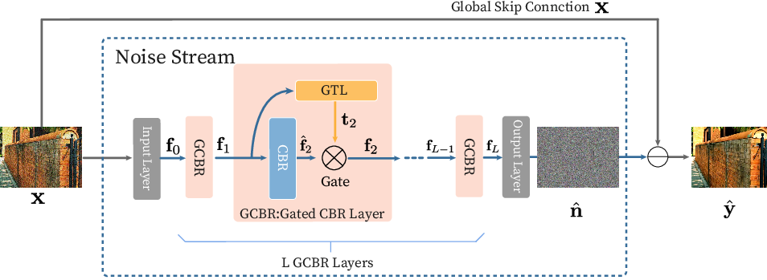

# Gated Texture CNN

This repository contains the code for the following paper:

#### Gated Texture CNN for Efficient and Configurable Image Denoising [[arXiv](https://arxiv.org/abs/2003.07042)]

Kaito Imai, [Takamichi Miyata](https://sites.google.com/site/takamichimiyata/) 

If you find this work useful in your research and use this code, please cite:

```
@article{imai2020gated,
title={Gated Texture CNN for Efficient and Configurable Image Denoising},
author={Imai, Kaito and Miyata, Takamichi},
journal={arXiv preprint arXiv:2003.07042},
year={2020}
}
```




## Quick Modification Demo

You can run a demo local machine or [colab](https://colab.research.google.com/drive/1zYYH8PCqEKSSSy6Y4PJgCJEk81n_aw_c). 

To run the test/train code, please clone this repo and see below instructions.


## Dependencies

We provide [requirements.txt](./requirements.txt).

- Python 3   (Recommend to use Anaconda)
- numpy
- PyTorch >= 1.0
- torchvision
- NVIDIA GPU + CUDA
- opencv
- tqdm
- PyYAML
- OmegaConf
- Comet.ml,(for logging) 

- [Apex](https://www.github.com/nvidia/apex) (option for train)


## Evaluation

2. Download all test set in ./Dataset/test/.

   - [set12](https://github.com/cszn/FFDNet/tree/master/testsets)
   - [bsd68](https://github.com/cszn/FFDNet/tree/master/testsets)
   - [cbsd68](https://github.com/cszn/FFDNet/tree/master/testsets)
   - urban100

3. Run the [test script](./run_test.sh).

   ```
   sh run_test.sh
   ```

You can change test set like  

```
python main.py confs/GTCNN experiment.test_only=True experiment.best_model=Color50_GTCNN_D1 dataset.test_set=[YourDataset]
```

More detailed see the How to Edit Config.

## Demo of Texture Modification 

2. Open the jupyter notebook [Demo_Texture_Modification]()

3. Run Demo!

## Training

1. Download [Div2K](https://data.vision.ee.ethz.ch/cvl/DIV2K/) train and  val set in ./Dataset/train/ and  ./Dataset/val/.

2. Run the [training script](./run_train.sh).

   ```
   sh run_train.sh
   ```

If you do not have enough RAM (required at least 64GB), you could use random crop options (We don't confirm the performance, expect not bad).  Also, We recommend use apex if the VRAM of GPU doesn't  enough to training. 

- random crop: `sh run_random_crop_train.sh`
- Train with apex: `sh run_apex_train.sh`

Note you should set the flag `model.GTL_stage_option=outconv_slim`, if the model depth is more than 5.

## How to Edit Config

If you want to change the configuration of experiments  (e.g,. batch size, depth, apex), you can edit the  default config (GTCNN.yaml) by OmegaConf.  

[OmegaConf docs](https://omegaconf.readthedocs.io/en/1.4_branch/)

[OmegaConf live tutorial](https://mybinder.org/v2/gh/omry/omegaconf/master?filepath=docs%2Fnotebook%2FTutorial.ipynb)

GTCNN.yaml contains config of experiment, dataset and model .

You can edit the config like below

```
python main.py confs/GTCNN experiment.color=1 experiment.device_ids=[0,1,2,4] experiment.opt_level=O1 experiment.saveImage=True dataset.train_set=[YourDataset] dataset.test_set=[YourDataset1,YourDataset2] model.depth=5
```

- Examples
  - Change color to gray or color: `experiment.color=1` or `=3`
  - Change the noise level: `experiment.sigma=40`
  - Use multi or change GPU:   `experiment.device_ids=[0]` or  `=[3]` or  `=[0,1,2,3]`
  - Run test: `experiment.test_only=True`
  - Load your pretrain: `experiment.bestmodel =FileName`
  - save the denoised images in the local folder: `experiment.saveImage=True`
  - Use Apex: :`experiment.opt_level=O1` or `=O2`
  - Change BatchSize: `experiment.batchsize=256` 
  - Change the depth of model: `model.depth=5`
  - Use your testset: `dataset.test_set=[YourDataset1,YourDataset2]`
  - Use comet log: `experiment.comet_disabled=False`
  - For Depth>5: `model.GTL_stage_option=outconv_slim`

And more details see the [GTCNN.yaml](./confs/GTCNN.yaml)

